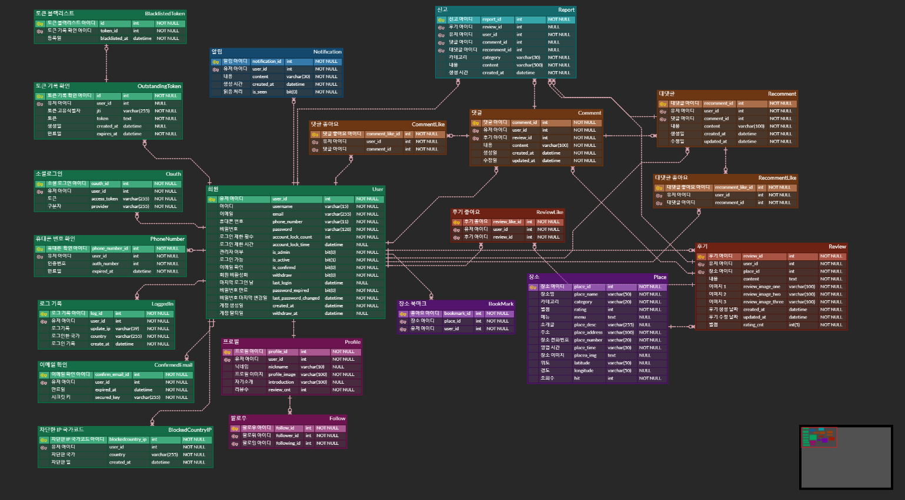
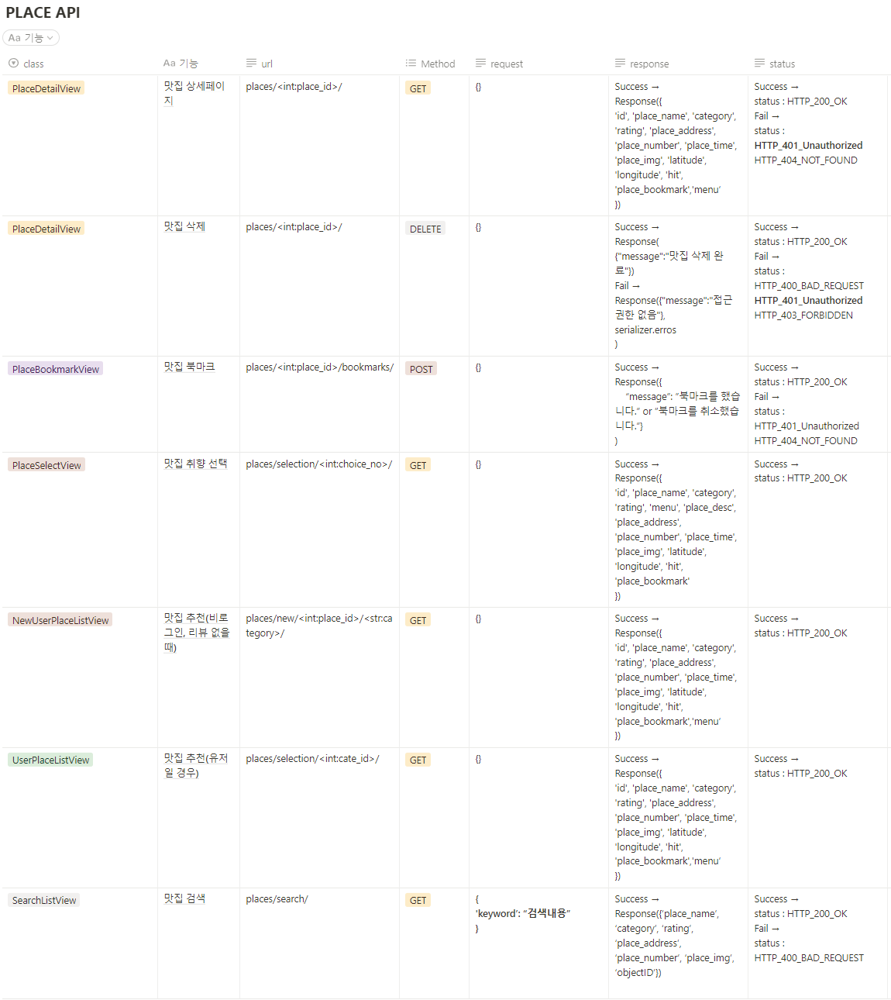
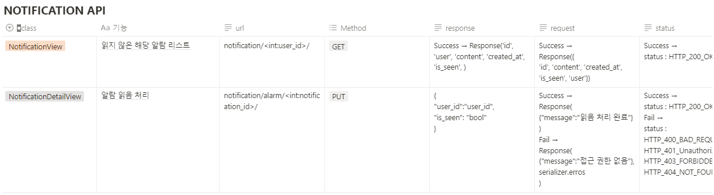
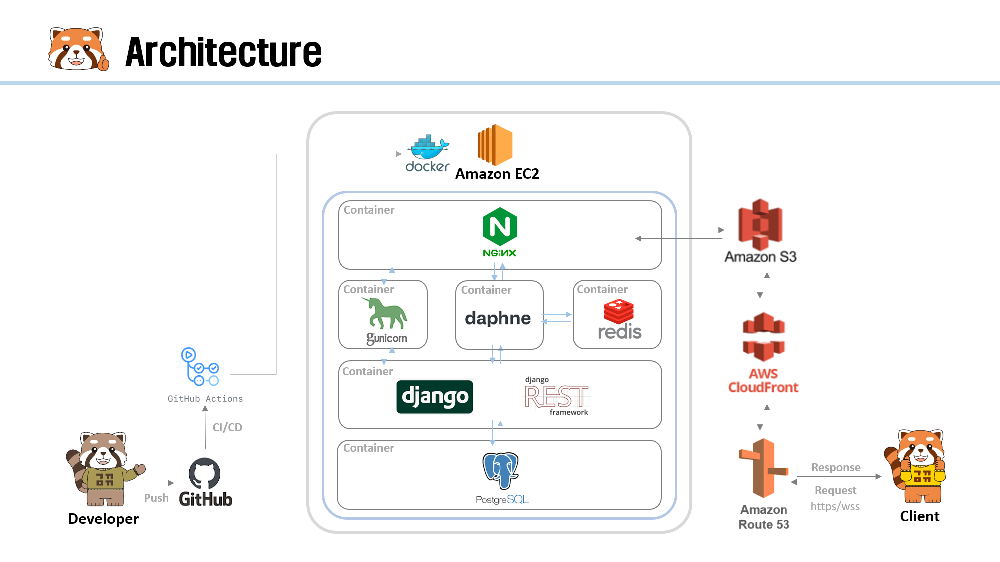
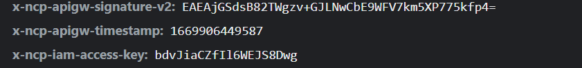

# :pushpin: 가까? 마까?
>제주도 맛집 추천 플랫폼  
>https://www.gaggamagga.shop  

 

## 1. 제작 기간 & 참여 인원 & 맡은 역할
- 2022년 12월 1일 ~ 12월 29일
- 팀 프로젝트 (팀장)

맡은 역할

- 유저관리, 프로필, 개인설정 및 추가기능
- User 테스트 코드
- Docker, AWS 배포
- CI/CD 구축
- 코드 리팩토링 / Swagger 적용

 

## 2. 사용 기술
#### `Back-end`
  - Python 3.10.8
  - Django 4.1.3
  - DRF 3.14.0
  - Django simple JWT 5.2.2
  - Django Channel 4.0.0
#### `Database`
  - PostgreSQL 14.5
#### `Infra`
  - AWS EC2
  - AWS  Load Balancer
  - AWS CloudFront
  - AWS S3
  - Docker 20.10.12
  - Docker Compose 2.11.2
  - Gunicorn
  - Nginx 1.23.2
  - Daphne
  - Redis 7.0.7
  - Github Action
#### `Front-end`
  - Vanilla JS
  - Element UI
#### `Management`
  - Notion
  - Github
  - Slack

 

## 3. 핵심 기능
- 사용자 환경(회원가입, 로그인, 회원정보 관리, 팔로우, 비활성화, 아이디/비밀번호 찾기 등등)
- 맛집 후기(리뷰) 작성/수정/삭제, 조회수 카운트, 좋아요, 검색 기능
- 후기 댓글 작성/수정/삭제
- 후기 댓글의 대댓글 작성/수정/삭제 기능
- 유저간 댓글 알림 기능

 

## 4. [ERD 설계](https://www.erdcloud.com/d/RvXb4PCLq3t3CPb3e)

 

## 5. API 설계 | [Swagger API Docs](https://www.gaggamagga.tk)

<b>USER API</b>

<b>PLACE API</b>

<b>REVIEW API</b>
 

<b>NOTIFICATION API</b>

 

## 6. Architecture

 

## 7. 핵심 트러블 슈팅

<b>6.1. Email 전송 속도 향상</b>

- 저는 회원기능에 이메일 인증 기능을 구현했습니다. Django Email 전송 속도는 하나의 스레드를 사용함으로 많이 느렸습니다.

 

<b>기존 코드</b>

~~~python
def send_email(message):
    email = EmailMessage(subject=message["email_subject"], body=message["email_body"], to=[message["to_email"]])
    email.send()
~~~

- 이것을 개선하기 위해 멀티스레드를 활용하여 작업가중치를 늘려 실행되지 않는 다른 스레드를 퍼뜨려 사용자에게 응답하는 경로가 실시간으로 처리하여 속도를 향상했습니다. 2.5 s -> 0.1 ms

 

<b>개선된 코드</b>

~~~python
import threading
 
class EmailThread(threading.Thread):
    
    def __init__(self, email): 
        self.email = email 
        threading.Thread.__init__(self) 
        
    def run(self):
        self.email.send() 

def send_email(message):
    email = EmailMessage(subject=message["email_subject"], body=message["email_body"], to=[message["to_email"]])
    EmailThread(email).start()
~~~

 

<b>6.2. 네이버 SMS 401 에러</b>

- 저는 회원관리 기능에 아이디 찾기를 구현하였습니다. 대부분의 사이트는 아이디 찾기를 인증번호를 이용한 로직을 많이 사용하였고 접근성이 용이한 네이버 SMS API를 사용하였습니다. 요청을 보냈을 때 401에러가 발생하였습니다.

- 오류를 원리적으로 접근하기 위해 요청했을 때 콘솔창으로 네트워크 부분을 확인했습니다. signature-v2부분이 계속 바뀌는 것을 확인이 되었고 암호화가 되어 그 값이 바뀌는 것을 확인했습니다. 
  
 

<b>기존 코드</b>

~~~python
def send_sms(self):
    timestamp = str(int(time.time() * 1000))
    access_key =  get_secret("NAVER_ACCESS_KEY_ID")
    secret_key = get_secret("NAVER_SECRET_KEY")
    service_id = get_secret("SERVICE_ID")
    method = "POST"
    uri = f"/sms/v2/services/{service_id}/messages"
    message = method + " " + uri + "\n" + timestamp + "\n" + access_key
    message = bytes(message, "UTF-8")

headers = {
            "Content-Type": "application/json; charset=utf-8",
            "x-ncp-apigw-timestamp": timestamp,
            "x-ncp-iam-access-key": access_key,
            "x-ncp-apigw-signature-v2": secret_key,
        }
~~~

- 네이버 SMS API를 읽어보니  x-ncp-apigw-signature-v2에서 HMAC 암호화 알고리즘은 HmacSHA256 사용한다는 것을 알았고 암호화가 된 시크릿 키로 보내야 한다는 것을 알아 개선했습니다.

 

<b>개선된 코드</b>

~~~python
def send_sms(self):
    timestamp = str(int(time.time() * 1000))
    access_key =  get_secret("NAVER_ACCESS_KEY_ID")
    secret_key = bytes( get_secret("NAVER_SECRET_KEY"), "UTF-8")
    service_id = get_secret("SERVICE_ID")
    method = "POST"
    uri = f"/sms/v2/services/{service_id}/messages"
    message = method + " " + uri + "\n" + timestamp + "\n" + access_key
    message = bytes(message, "UTF-8")
    signing_key = base64.b64encode(
        hmac.new(secret_key, message, digestmod=hashlib.sha256).digest()
    )

headers = {
            "Content-Type": "application/json; charset=utf-8",
            "x-ncp-apigw-timestamp": timestamp,
            "x-ncp-iam-access-key": access_key,
            "x-ncp-apigw-signature-v2": signing_key,
        }
~~~

 

<b>6.3. 토큰 인증 에러</b>

- 프론트에서 로그인 시 access token과 refresh token을 발급을 해주는데 서비스 이용 시 access token이 만료가 되었을 경우 refresh token으로 access token을 재발급 해주면 되지만 그 토큰이 유효한지 확인해주는 로직이 없었습니다.
  
 

<b>기존 코드</b>

~~~python
    # urls.py
    path("api/token/", views.CustomTokenObtainPairView.as_view(), name="token_obtain_pair_view"),
    path("api/token/refresh/", TokenRefreshView.as_view(), name="token_refresh_view"),
~~~

~~~ javascript
//Front Login Request
async function Login() {
    const username = document.getElementById("username").value;
    const password = document.getElementById("password").value;

    const response = await fetch(
        `${backendBaseUrl}/users/api/token/`,
        { 
            headers: {
                'content-type': 'application/json'
            },
            method: 'POST',
            body: JSON.stringify({"username": username, "password": password})
        }
    )
    const response_json = await response.json()
    
    if (response.status === 200) {
        localStorage.setItem("access", response_json.access); 
        localStorage.setItem("refresh", response_json.refresh);

        const base64Url = response_json.access.split('.')[1];
        const base64 = base64Url.replace(/-/g, '+').replace(/_/g, '/');
        const jsonPayload = decodeURIComponent(
            atob(base64).split('').map(function (c) {
                return '%' + (
                    '00' + c.charCodeAt(0).toString(16)
                ).slice(-2);
            }).join('')
        );
        localStorage.setItem("payload", jsonPayload);}}
~~~

- DRF Simple JWT에서 해답을 얻을 수 없을까 공식문서를 읽어보니 토큰 값을 확인해주는 로직이 있었습니다. 유효한 토큰일 경우 status 200 유효하지 않을 경우 status 401 Response결과로 프론트에서 로직을 구성했습니다.

<b>개선된 코드</b>

~~~python
#urls.py
    path("api/token/", views.CustomTokenObtainPairView.as_view(), name="token_obtain_pair_view"),
    path("api/token/refresh/", TokenRefreshView.as_view(), name="token_refresh_view"),
    path("api/token/verify/", TokenVerifyView.as_view(), name="token_verify"),
~~~

~~~ javascript
// Access token verify Logic
async function access_verify_token() {

    const response = await fetch(
        `${backendBaseUrl}/users/api/token/verify/`,
        { 
            headers: {
                'content-type': 'application/json'
            },
            method: 'POST',
            body: JSON.stringify({"token": localStorage.getItem("access")})
        }
    )
    if (response.status === 200) { 

    }
    if (response.status === 401){
        refresh_verify_token()
        
    }
}

// Refresh token verify Logic
async function refresh_verify_token() {

    const response = await fetch(
        `${backendBaseUrl}/users/api/token/verify/`,
        { 
            headers: {
                'content-type': 'application/json'
            },
            method: 'POST',
            body: JSON.stringify({"token": localStorage.getItem("refresh")})
        }
    )
    if (response.status === 200) { 
        access_token_get()
    }
    if (response.status === 401){
        localStorage.clear()
        window.location.reload()
    }
}

// Access token get Logic
async function access_token_get() {

    const response = await fetch(
        `${backendBaseUrl}/users/api/token/refresh/`,
        { 
            headers: {
                'content-type': 'application/json'
            },
            method: 'POST',
            body: JSON.stringify({"refresh": localStorage.getItem("refresh")})
        }
    )

    const response_json = await response.json()

    if (response.status === 200) {

    localStorage.removeItem("access")
    localStorage.removeItem("payload")
    localStorage.setItem("access", response_json.access); 

    const base64Url = response_json.access.split('.')[1];
    const base64 = base64Url.replace(/-/g, '+').replace(/_/g, '/');
    const jsonPayload = decodeURIComponent(
        atob(base64).split('').map(function (c) {
            return '%' + (
                '00' + c.charCodeAt(0).toString(16)
            ).slice(-2);
        }).join('')
    );
    localStorage.setItem("payload", jsonPayload);
    window.location.reload()
}}
~~~

 

## 8. 피드백 반영

<b>비밀번호 변경 시 인증</b>

- 비밀번호 변경 시 개인정보가 보호받지 못하는 느낌입니다. 기존 비밀번호를 입력받아 확인하는 절차가 추가되면 좋을 것 같습니다.(피드백 내용)

 

<b>기존 코드</b>

~~~python
#serializer.py
def validate(self, data):
    password = data.get("password")
    repassword = data.get("repassword")
~~~

- 해쉬 값을 확인하는 check_password 메소드를 활용하여 인증할 수 있는 기능을 추가했습니다.

 

<b>개선된 코드</b>

~~~python
#serializer.py
confirm_password = serializers.CharField(
    error_messages={
        "required": "비밀번호를 입력해주세요.",
        "blank": "비밀번호를 입력해주세요.",
        "write_only": True,
    }
)

def validate(self, data):
    current_password = self.context.get("request").user.password
    confirm_password = data.get("confirm_password")
    password = data.get("password")
    repassword = data.get("repassword")

    # 현재 비밀번호 예외 처리
    if not check_password(confirm_password, current_password):
        raise serializers.ValidationError(detail={"password": "현재 비밀번호가 일치하지 않습니다."})
~~~

 

<b>자신이 작성한 게시글 신고됨</b>

- 작성자 게시글에 작성자가 신고할 수 있어요(피드백 내용)

 

<b>기존 코드</b>

~~~python
#views.py
def post(self, request, place_id, review_id):
    review_author = get_object_or_404(Review, id=review_id).author
    try:
        Report.objects.get(author=request.user.id, review=review_id)
        return Response({"message": "이미 신고를 한 리뷰입니다."}, status=status.HTTP_208_ALREADY_REPORTED)

    except Report.DoesNotExist:
        serializer = ReportSerializer(data=request.data)
        if serializer.is_valid():
            serializer.save(author=request.user, review_id=review_id)
            return Response({"message": "신고가 완료되었습니다."}, status=status.HTTP_200_OK)
        return Response(serializer.errors, status=status.HTTP_400_BAD_REQUEST)
~~~

- 요청 들어오는 유저와 작성자와 비교하여 400 status Response를 하도록 구현했습니다.

 

<b>개선된 코드</b>

~~~python
#views.py
def post(self, request, place_id, review_id):
    review_author = get_object_or_404(Review, id=review_id).author
    if review_author == request.user:
        return Response({"message": "작성자는 신고를 할 수 없습니다."}, status=status.HTTP_400_BAD_REQUEST)

    try:
        Report.objects.get(author=request.user.id, review=review_id)
        return Response({"message": "이미 신고를 한 리뷰입니다."}, status=status.HTTP_208_ALREADY_REPORTED)

    except Report.DoesNotExist:
        serializer = ReportSerializer(data=request.data)
        if serializer.is_valid():
            serializer.save(author=request.user, review_id=review_id)
            return Response({"message": "신고가 완료되었습니다."}, status=status.HTTP_200_OK)
        return Response(serializer.errors, status=status.HTTP_400_BAD_REQUEST)
~~~

 

<b>IP 주소 차단 기능</b>
 

- IP 주소 차단같은 기능이 있으면 좋을 것 같아요(피드백 내용)
 
- IP의 정보를 알 수 있는 API를 활용하여 해당 나라 IP일 경우 차단되도록 기능 구현했습니다.

 

<b>코드</b>

~~~python
#utils.py
def get_client_ip(request):
    x_forwarded_for = request.META.get("HTTP_X_FORWARDED_FOR")
    if x_forwarded_for:
        ip = x_forwarded_for.split(",")[0]
    else:
        ip = request.META.get("REMOTE_ADDR")
    return ip

def find_ip_country(user_ip):
    serviceKey = get_secret("WHOIS_KEY")
    url = "http://apis.data.go.kr/B551505/whois/ip_address?serviceKey=" + serviceKey + "&query=" + user_ip + "&answer=json"
    request = urllib.request.urlopen(url).read().decode("utf-8")
    return dict(eval(request))["response"]["whois"]["countryCode"]

#jwt_claim_serializer.py
user_ip = Util.get_client_ip(self.context.get("request"))
country = Util.find_ip_country(user_ip)
if BlockedCountryIP.objects.filter(user=self.target_user, country=country).exists():
    raise serializers.ValidationError(detail={"error": "해당 IP를 차단한 계정입니다."})
~~~

 

 

## 9. 회고 / 느낀점 / 현황판 / 그 외 트러블 슈팅
>프로젝트 개발 회고 글: https://bolder-starburst-a73.notion.site/221229-509674920cc44056b5a06ab88d2c4f73
 
>프로젝트 현황판 / 그 외 트러블 슈팅: https://bolder-starburst-a73.notion.site/060c8fd4af5845df8770441ef69bdaf5