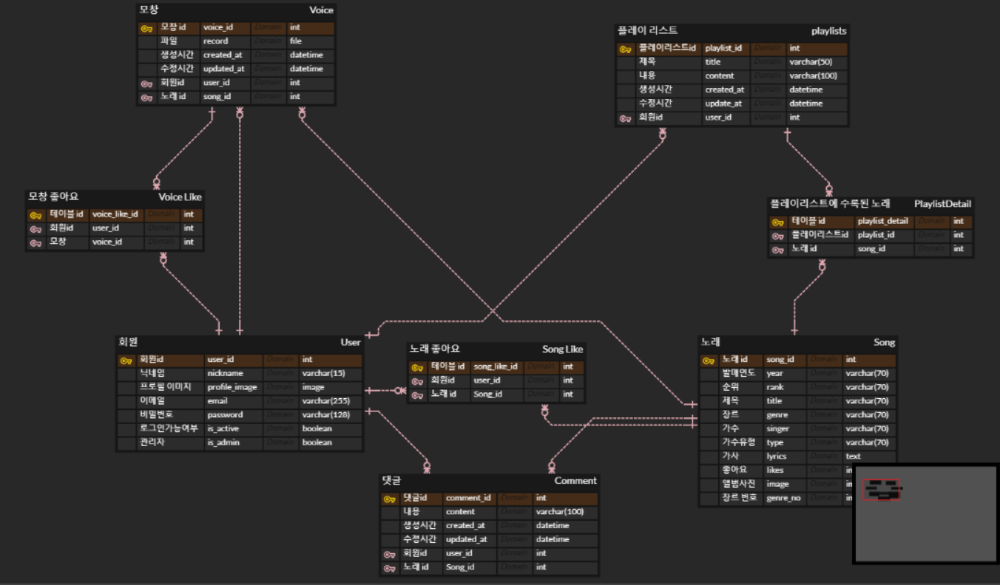
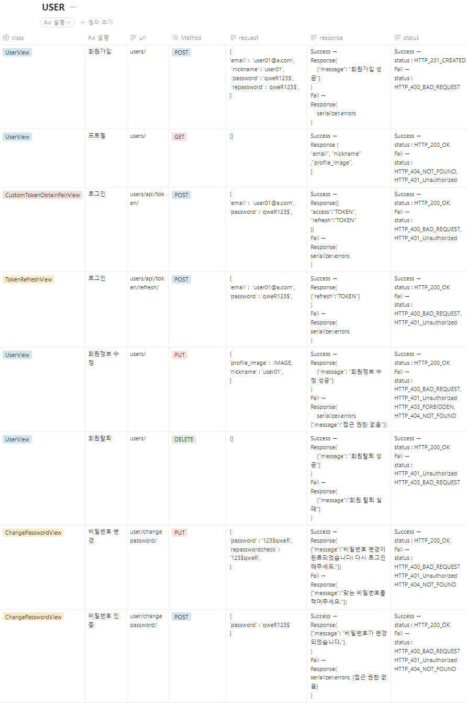
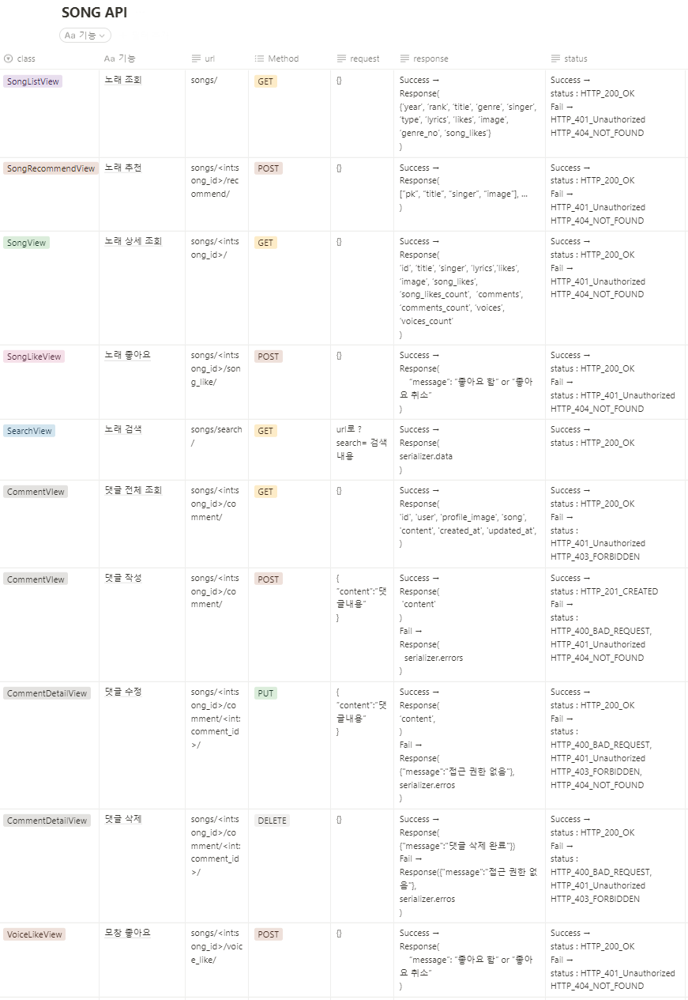
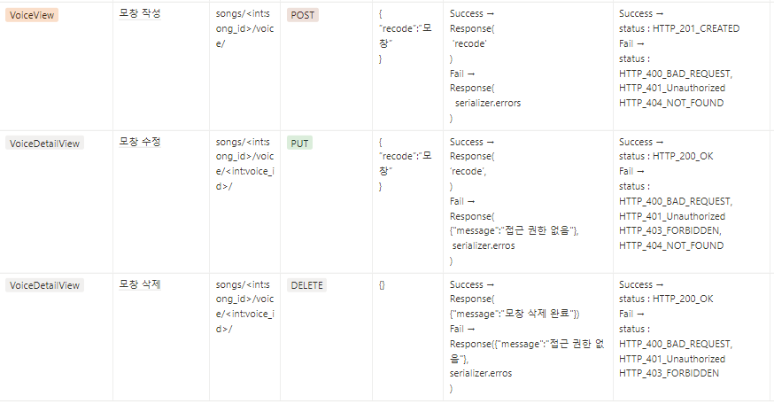
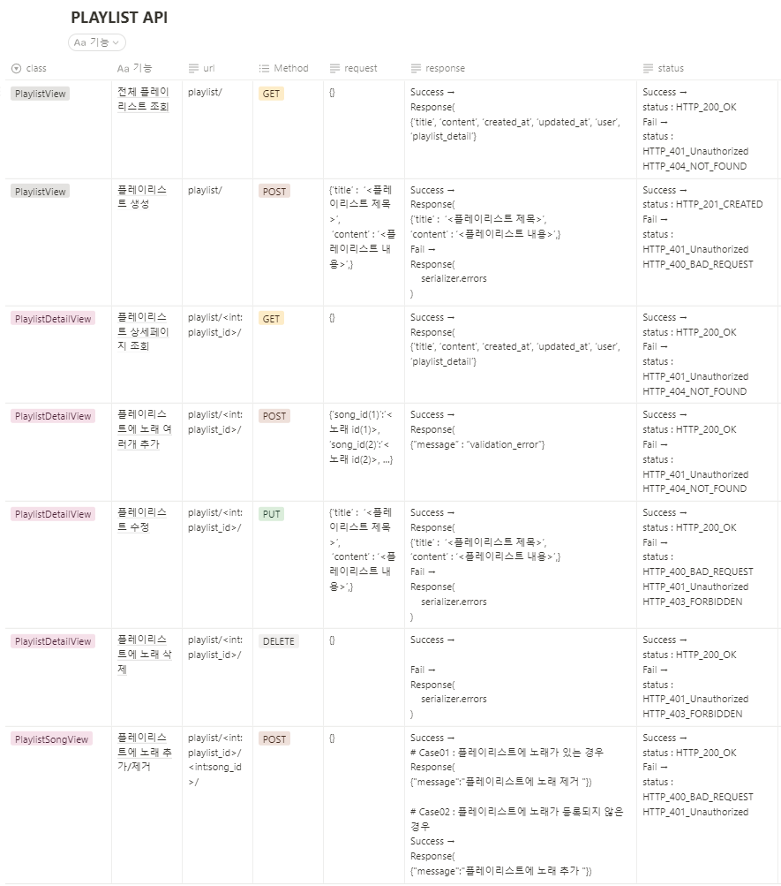

# :pushpin:노래 추천 프로젝트
>노래 추천 서비스
 

 

## 1. 제작 기간 & 참여 인원 & 맡은 역할
- 2022년 11월 2일 ~ 11월 8일
- 팀 프로젝트 (5명)

맡은 역할

- 유저 관리 및 추가 기능
- Playlist 생성/수정/삭제 및 상세페이지 기능
  

 

## 2. 사용 기술
#### `Back-end`
  - Python 3.10.7
  - Django 4.1.3
  - DRF 3.14.0
  - Django simple JWT 5.2.2
#### `Database`
  - SQLite
#### `Front-end`
  - Vanilla JS
  - Element UI
#### `Management`
  - Notion
  - Github
  - Slack

 

## 3. 핵심 기능
- 사용자 환경(회원가입, 로그인, 회원정보 관리 등)
- 플레이리스트 작성, 수정, 삭제 기능 구현(사진 업로드 등)
- 댓글 및 모창 업로드, 좋아요 기능 구현
- 사용자 취향에 맞는 음악 추천

 

## 4. [ERD 설계](https://www.erdcloud.com/d/KSbbFqb8PAppJjMR9)

 

## 5. API 설계 

<b>USER API</b>

<b>SONG API</b>

<b>PLAYLIST API</b>
 

 

## 6. 트러블 슈팅
### 6.1. Email 전송 속도 향상(멀티스레드 적용)

- 문제: 비밀번호 찾기 기능 구현 중 이메일 전송 속도 느림
- 문제의 원인: 스레드를 하나를 이용하기에 느린 것으로 파악

<b>기존 코드</b>

~~~python

def send_email(message):
    email = EmailMessage(subject=message["email_subject"], body=message["email_body"], to=[message["to_email"]])
    email.send()

~~~

- 해결: 멀티스레드 적용 후 작업가중치를 늘려 실행하지 않는 다른 스레드를 퍼뜨려 사용자에게 응답하는 경로가 실시간으로 처리하여 속도 향상 2.5s -> 0.1ms 

 

<b>개선된 코드</b>

~~~python

import threading
 
class EmailThread(threading.Thread):
    def __init__(self, email): 
        self.email = email 
        threading.Thread.__init__(self) 
        
    def run(self):
        self.email.send() 

def send_email(message):
    email = EmailMessage(subject=message["email_subject"], body=message["email_body"], to=[message["to_email"]])
    EmailThread(email).start()

~~~

 

### 6.2. Serializer Request
- 문제: 요청에 대한 정보를 serializers.py에 사용하는 방법 모름
- 해결: serializer를 검증할 때 dict로 request를 넘겨주어 해결

<b>코드</b>

~~~python
#views.py
serializer = ChangePasswordSerializer(user, data=request.data, context={'request': request})

#serializers.py
current_password = self.context.get("request").user.password
~~~

 

### 6.3. serializer validate error
- 문제: drf 유효성 검증 로직 구현 안됨
- 문제의 원인: drf에서 이미 제공하는 유효성 검증 로직이 있는 것으로 파악

 

<b>기존 코드</b>

~~~python
#serializers.py
nickname = date.get('nickname')
if nickname == '':
	raise serializers.ValidationError(detail={"nickname":"닉네임을 임력해주세요"})
~~~

- 해결: validate커스터마이징 시 unique 에러를 처리하고 싶으면 error message를 unique error에 대한 정의 해줌, 
빈값과 필드값이 비어있으면 extra_kwargs를 사용하여 설정 변경함(required와 blank와 invlid 사용)

 

<b>개선된 코드</b>

~~~python
#models.py
email = models.EmailField( max_length=255,unique=True, error_messages={'unique': "이미 존재하는 이메일 주소입니다."})
nickname = models.CharField(max_length=15, unique=True, error_messages={'unique': "이미 존재하는 닉네임입니다."})

#serializers.py
extra_kwargs= 
{'email': {'error_messages': {
'required': '이메일을 입력해주세요.',
'invalid': '알맞은 형식의 이메일을 입력해주세요.',
'blank':'이메일을 입력해주세요.',}},
  
'nickname': {
'error_messages': {
'required': '닉네임을 입력해주세요.',
'blank':'닉네임을 입력해주세요',}},}
~~~

 

## 7. 팀원 갈등
- 문제: 주제 선정에 갈등이 있어 쉽게 결정을 내리지 못하는 상황
- 해결: 기획설명과 멜론 100위 크롤링 데이터를 준비하여 설득하여 납득 후 주제 결정
- 깨달은 점: 추상적인 아이디어를 내는 것보다 정확한 데이터와 설명으로 설득할 수 있다는 점

<b>크롤링 코드</b>

~~~python
from urllib.request import urlopen
import pandas as pd
import urllib.request
import urllib.parse
import time
from selenium import webdriver
from selenium.common.exceptions import NoSuchElementException

driver = webdriver.Chrome('C:/chromedriver_win32/chromedriver.exe') #크롬 드라이버 접근
driver.implicitly_wait(1)

url = 'https://www.melon.com/chart/age/index.htm?chartType=YE&chartGenre=KPOP&chartDate='
year = ['1990','1991','1992','1993','1994','1995','1996','1997','1998','1999', '2000', '2001','2002','2003','2004','2005','2006','2007','2008','2009','2010','2011','2012','2013','2014', '2015','2016','2017','2018','2019']

#전체 데이터를 담을 곳
df = pd.DataFrame() 

#test
driver.get(url+year[0]) #연도 선택 - 반복문 

jenre = [] # 큰 반복문 안에
lyrics = []
titles = []
year = []

for i in range(50):

    info_list = driver.find_elements_by_css_selector('#lst50 > td:nth-child(4) > div > a') #Top50 리스트 #Top50 리스트
    info_list[i].click() #곡정보 선택
    time.sleep(2)

    #가사 펼치기
    try:
        driver.find_element_by_css_selector('.button_more.arrow_d').click()
        time.sleep(2)
    except NoSuchElementException: #가사가 없는 경우 펼치기 수행x
        pass
   

    #장르, 가사, 노래 제목 크롤링
    titles.append(driver.find_element_by_css_selector('#downloadfrm > div > div > div.entry > div.info > div.song_name').text)
    jenre.append(driver.find_element_by_css_selector('#downloadfrm > div > div > div.entry > div.meta > dl > dd:nth-child(6)').text)
    lyrics.append(driver.find_element_by_css_selector('#lyricArea').text)
    year.append('1990')
    
    driver.back()
    time.sleep(2)

df = pd.DataFrame(zip(year, titles, jenre, lyrics), columns=['year','titles','jenre','lyrics'])

time.sleep(2)
driver.close()

df.to_csv('C:/Users/haeni_kim/Desktop/PROJECT/multi_project/melon_inform.csv',encoding = 'utf-8-sig')
~~~

## 8. 회고 / 느낀점 / 현황판 / 그 외 트러블 슈팅
>프로젝트 개발 회고 글: https://bolder-starburst-a73.notion.site/221108-9cab6c3034624797b2d3c3179e79c282
 

>프로젝트 현황판 / 그 외 트러블 슈팅: https://bolder-starburst-a73.notion.site/0ddbb2be0a474d35a4a957278980445b
