# :pushpin:유화 경매 프로젝트
>유화 제작 경매 서비스  
 

 

## 1. 제작 기간 & 참여 인원 & 맡은 역할
- 2022년 11월 22일 ~ 11월 28일
- 팀 프로젝트 (5명)

맡은 역할

- 유저 관리 및 추가 기능
- 포인트 적립, 사용 기능
- User 테스트코드 

 

## 2. 사용 기술
#### `Back-end`
  - Python 3.10.7
  - Django 4.1.3
  - DRF 3.14.0
  - Django simple JWT 5.2.2
#### `Database`
  - SQLite
#### `Front-end`
  - Vanilla JS
  - Element UI
#### `Management`
  - Notion
  - Github
  - Slack

 

## 3. 핵심 기능
- 사용자 환경(회원가입, 로그인, 회원정보 관리 등)
- 유화 작품 생성, 수정, 삭제 기능 구현(사진 업로드, 유화 스타일 선택/적용 등)
- 나의 유화 작품 경매 등록, 삭제 기능 구현
- 포인트 적립, 사용 기능 구현
- 댓글 생성, 수정, 삭제 기능 구현

 

## 4. [ERD 설계](https://www.erdcloud.com/d/pqrad25r55RSeqcYS)
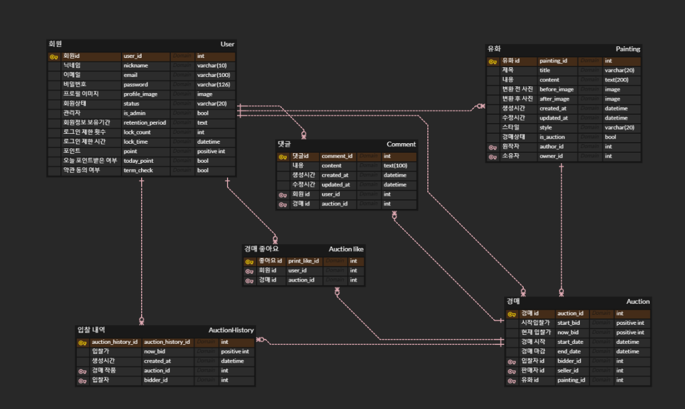

 

## 5. API 설계 

<b>USER API</b>

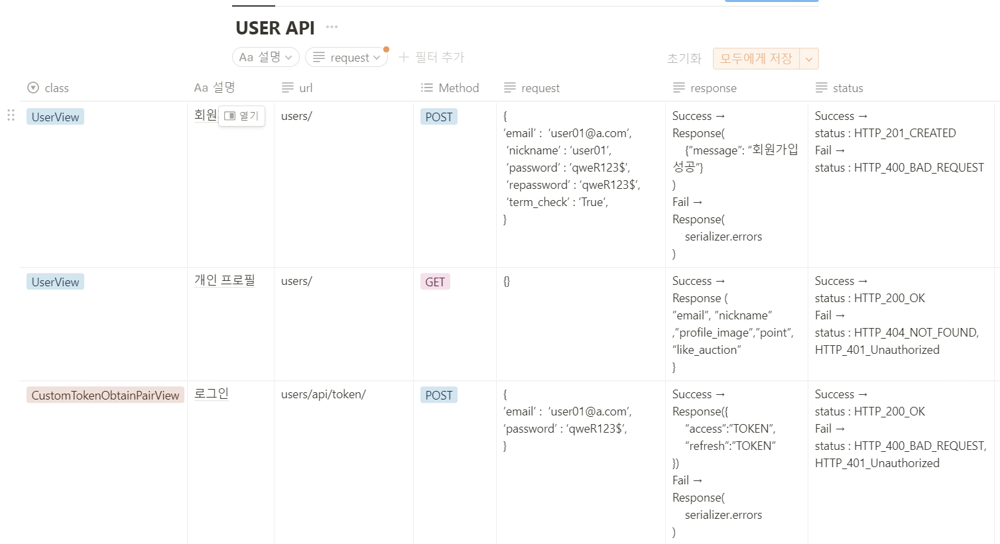
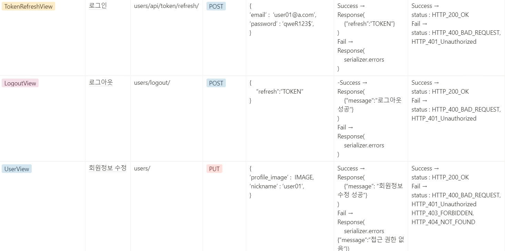
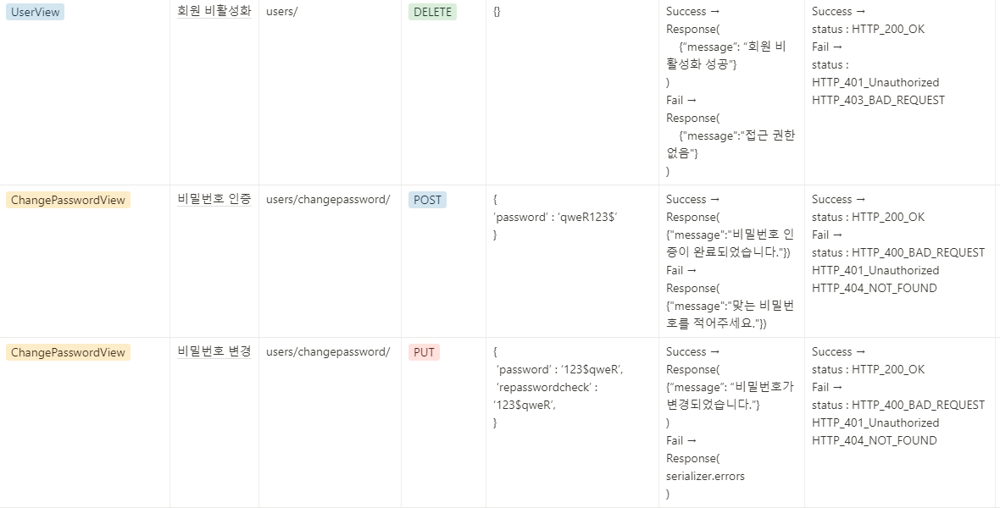
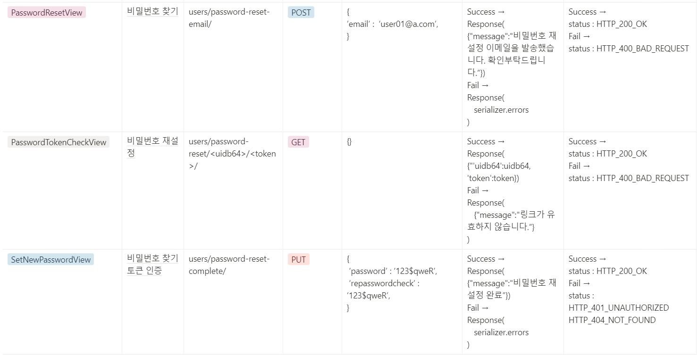

<b>PAINTING API</b>

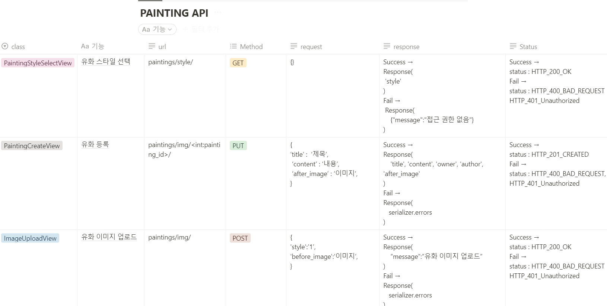
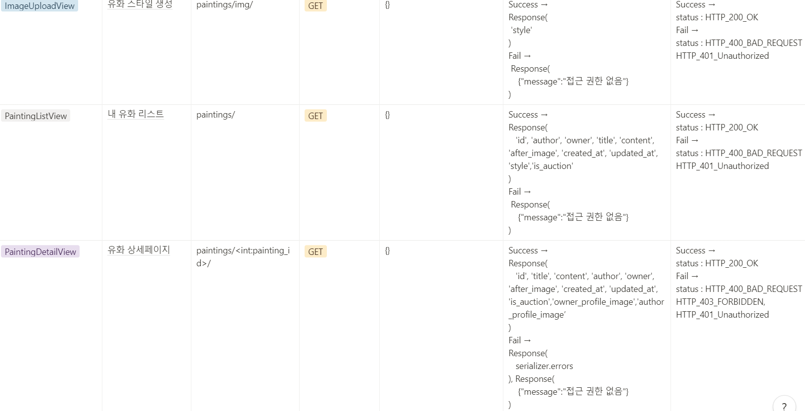

<b>AUCTION API</b>
 

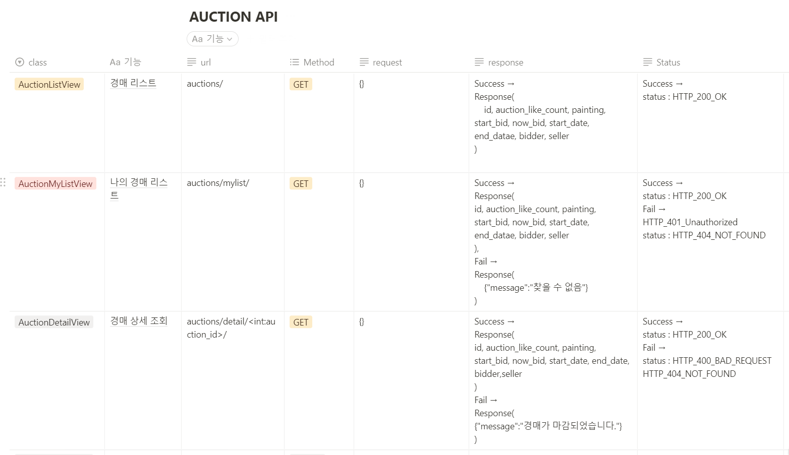
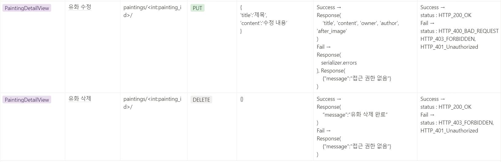
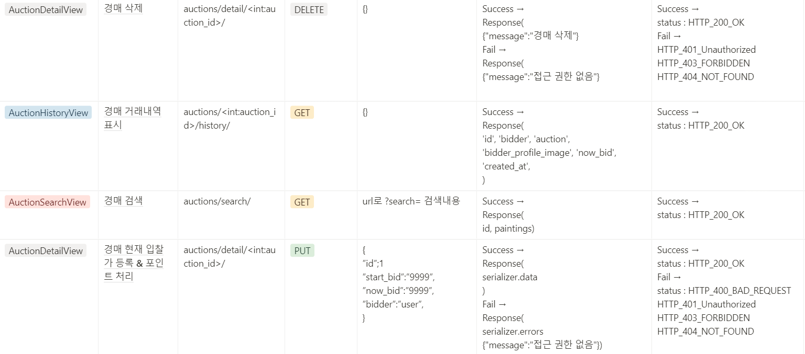
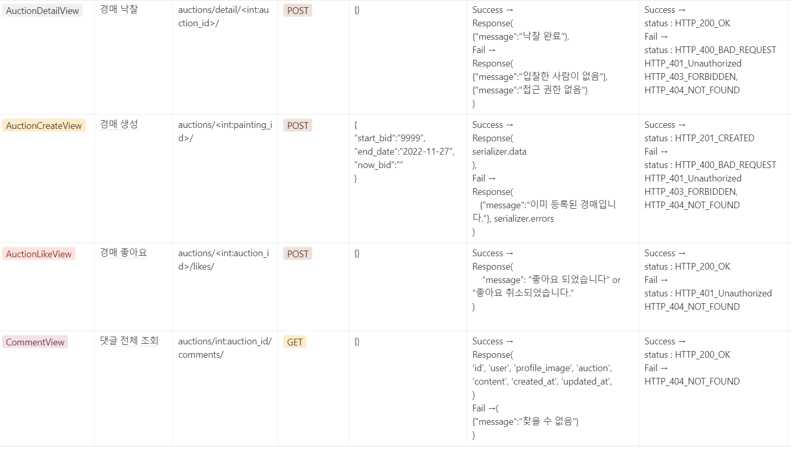
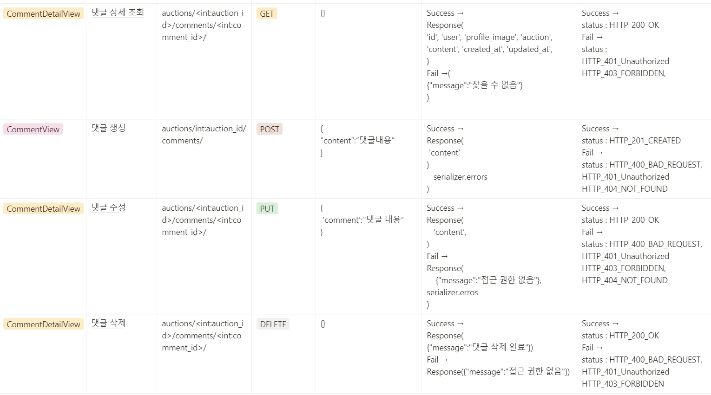

 

## 6. 트러블 슈팅

<b>6.1. Unicode Error</b>

- JSON으로 서버에있는 사진을 불러오려면 사진 파일을 불러오는 것인줄 알았습니다. image를 불러오려고 하니 unicode error가 발생했습니다

 

<b>기존 코드</b>

~~~python
#serializer.py
def get_author_profile_image(self, obj):
        return obj.author.profile_image
~~~

- 서버에 저장되어있는 파일을 그대로 가져오는 것이 아닌 url을 가져오는 것을 알고 수정했습니다.

 

<b>개선된 코드</b>

~~~python
def get_author_profile_image(self, obj):
        return obj.author.profile_image.url
~~~

 

<b>6.2. Byte error</b>

- 비밀번호 찾기를 기능 중에 uidb64와 token을 대조하여 구현하려고 했습니다. user id를 urlsafe_base64_encode 메소드를 사용하려고 했으나 byte type error가 발생했습니다.

 

<b>기존 코드</b>

~~~python
uidb64 = urlsafe_base64_encode(user.id)
~~~

- byte로 변환하기 위해서 smart_byte라는 메소드를 사용하여 변환하였습니다. 또한 반대로 byte를 str값으로 변환하려면 decode한 다음 force_str 메소드를 사용해주었습니다.

 

<b>개선된 코드</b>

~~~python
# encode
uidb64 = urlsafe_base64_encode(smart_bytes(user.id))

# decode
user_id = force_str(urlsafe_base64_decode(uidb64))
~~~

 

## 7. 회고 / 느낀점 / 현황판 / 그 외 트러블 슈팅
>프로젝트 개발 회고 글: https://bolder-starburst-a73.notion.site/221128-9950cd25bced4f6e8e71092ddf86f889
 
>프로젝트 현황판 / 그 외 트러블 슈팅: https://bolder-starburst-a73.notion.site/c4e68e7765b64fd3bef2fb0071fb8996